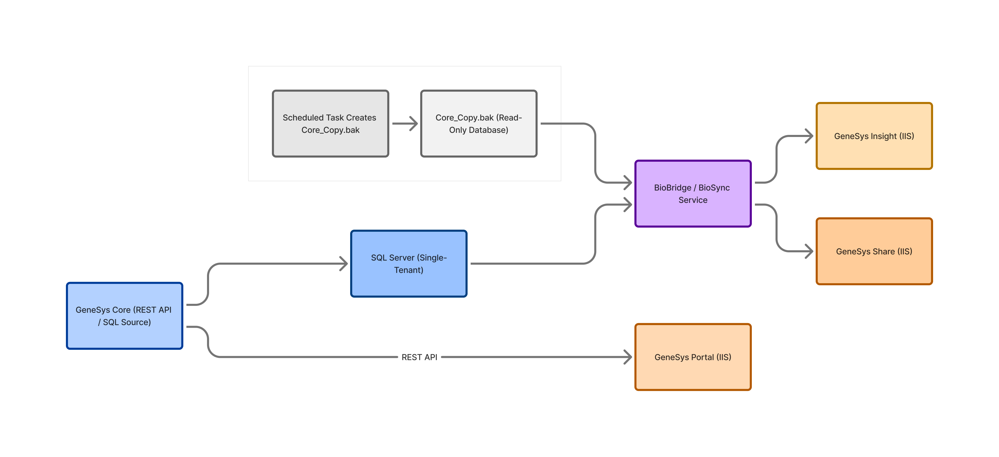
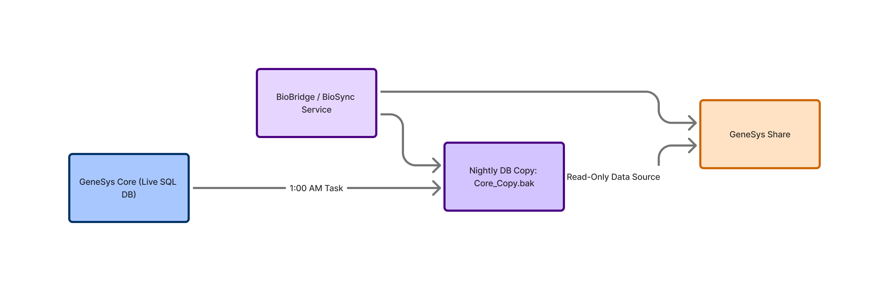
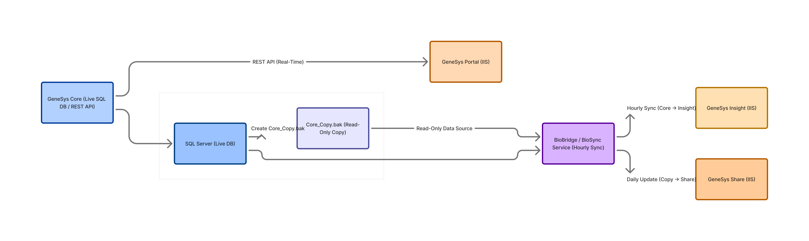

---

# **GeneSys Research Suite – System Overview**

*Internal Documentation – v1.1 (Revised)*
*Author: Hashim Zaffar*

---

## **1. Introduction**

The GeneSys Research Suite is a single-tenant, on-premise platform used by life science labs to manage sequencing workflows, sample tracking, and analytics. Each lab receives its own isolated Windows Server environment, ensuring data privacy and eliminating cross-tenant risk.

This document provides a concise overview of the system’s architecture, major components, data flows, and scheduled tasks. It is intended for Support, Customer Success (CS), and QA teams.

---

## **2. High-Level Architecture**

Each client has their own:

* Windows Server
* SQL Server instance
* IIS-hosted web applications
* BioBridge/BioSync Windows Service
* Nightly database copy task (for Share customers)

---

## **3. Core Components**

### **3.1 GeneSys Core (Required)**

The main desktop application where scientists record samples, sequencing runs, and experiment metadata.

| Attribute      | Details                       |
| -------------- | ----------------------------- |
| Hosting        | Local Windows Server          |
| Database       | Microsoft SQL Server          |
| Authentication | Windows Authentication        |
| Role           | System of record for all data |

All other GeneSys products depend on data originating from Core.

---

### **3.2 Web Applications (Optional, License-Dependent)**

Each web app is hosted under IIS and uses different authentication patterns.

#### **GeneSys Portal**

* Researchers submit sequencing requests and track project progress.
* Communicates with Core via **REST API** (does **not** use BioBridge).
* **Authentication:** OAuth.

#### **GeneSys Insight**

* Provides dashboards and visual analytics.
* Requires BioBridge to sync data **hourly** from Core → Insight.
* **Authentication:** API keys.

#### **GeneSys Share**

* Shares approved or sanitized data externally.
* Cannot read Core directly—uses a **nightly copied database** to ensure validated results only.
* **Authentication:** Token-based (standardized internally).

---

## **4. BioBridge / BioSync Service**

BioBridge (formerly BioSync) is a Windows Service installed on each client environment.

| Product | Uses BioBridge? | Sync Mode                   |
| ------- | --------------- | --------------------------- |
| Portal  | ❌ No            | Direct REST to Core         |
| Insight | ✅ Yes           | Hourly push                 |
| Share   | ✅ Yes           | Reads nightly database copy |

Key behaviors:

* Runs **hourly** to update Insight analytics.
* Consumes the **Core_Copy.bak** file to refresh Share.
* Naming varies across existing deployment logs (BioBridge/BioSync/Bridge Sync).

---

## **5. Nightly Database Copy Process (Share Only)**

Share must only display **validated** results. To prevent accidental exposure of in-progress or unreviewed data, it relies on a nightly copy.

**Process (1:00 AM):**

1. Windows Scheduled Task creates a SQL backup:
   **Core_Copy.bak**
2. Copy is stored in a lab-specific path (often `D:\BioBridge\Copies\`, but not always).
3. BioBridge loads this copy to update Share.

**Common Issues:**

* Low disk space → task fails (0x1), causing Share to display stale data.
* Backup path inconsistencies between labs create troubleshooting challenges.

---

## **6. Deployment Model**

The CS team manually provisions each customer environment. Although ~90% standardized, historical variations exist across authentication configs, backup paths, and naming.

**Standard Deployment Steps**

* Install SQL Server
* Deploy IIS sites:

  * Portal (8080)
  * Insight (8081)
  * Share (8082)
* Install & configure BioBridge/BioSync
* Configure Scheduled Tasks:

  * Nightly DB copy (Share)
  * Hourly sync (Insight)
* Validate authentication flows
* Test end-to-end data movement

---

## **7. Data Flow Summary**

### **Portal → Core (Real-Time)**

* Direct REST API calls
* Used for request submission & updates

### **Core → Insight (Hourly)**

* BioBridge pushes experiment, sample, and results data
* Enables near-real-time dashboards

### **Core → Nightly Copy → Share (Daily)**

* 1 AM backup produces Core_Copy.bak
* BioBridge populates Share from this copy
* Ensures only **validated** data is exposed externally

---

## **8. Assumptions**

The following assumptions are based on internal logs and support material:

* “BioBridge,” “BioSync,” and “Bridge Sync” all refer to the same Windows Service.
* Share uses only the nightly copy; it never connects to Core directly.
* Authentication methods listed represent intended design; older deployments may differ.
* Backup path standardization is an ongoing initiative; paths vary today.

---

## **9. Conclusion**

GeneSys is a modular, single-tenant, on-prem platform centered around GeneSys Core. Web applications extend functionality, while BioBridge and scheduled tasks manage synchronization and data integrity. The nightly copy process ensures compliance and safe external data sharing.

This overview provides Support, CS, and QA teams with a unified reference for understanding system behavior and operational flows.
