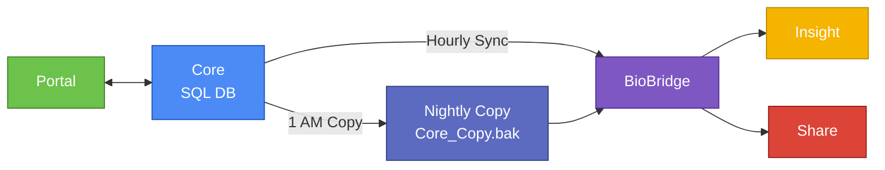
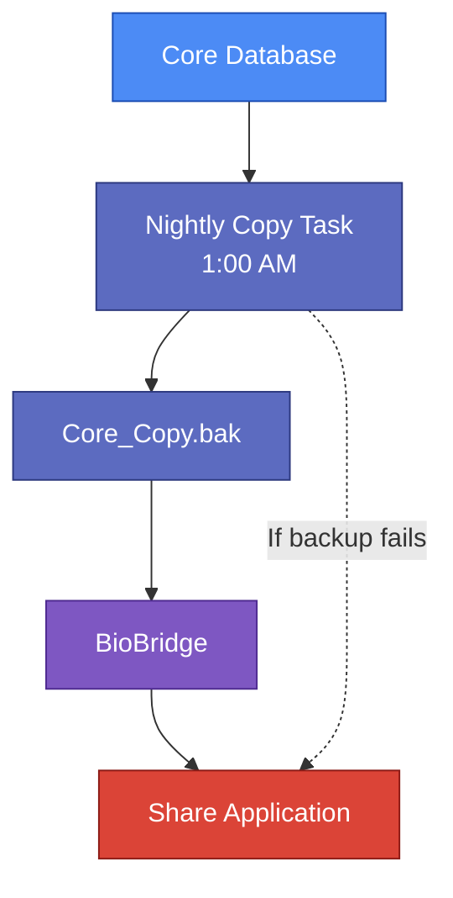

---

# GeneSys Research Suite: System Overview

## Document Control

| Field                 | Detail                         |
| --------------------- | ------------------------------ |
| Document Version      | 1.0                            |
| Last Updated          | November 2025                  |
| Author                | Hashim Zaffar                  |
| Reviewed By           | —                              |
| Approved By           | —                              |
| Document Status       | Draft / Approved / Final       |
| Confidentiality Level | Internal / Restricted / Public |

---

## 1. Purpose of This Document

This overview introduces new Support, Customer Success, and QA team members to the GeneSys Research Suite.
It explains:

* The role of each system component
* How data flows between Core, Portal, Insight, and Share
* Why the nightly copy exists and how BioBridge supports it
* Key hosting, authentication, and operational considerations

This document assumes general technical familiarity but does not require software development experience.

---

# 2. Architecture and Deployment Model

## 2.1 Single-Tenant Hosting

Each client receives an isolated on-premise environment that includes:

* A dedicated Windows Server
* One SQL Server instance
* IIS-hosted GeneSys web applications (licensed individually)
* The BioBridge Windows Service
* Scheduled tasks for hourly and nightly automation

No infrastructure is shared between clients. Minor variations exist due to licensing or legacy configurations.

## 2.2 Standard Components Installed

| Component         | Required         | Notes                               |
| ----------------- | ---------------- | ----------------------------------- |
| GeneSys Core      | Required         | Main system used by lab scientists  |
| Portal            | Optional         | Based on licensing                  |
| Insight           | Optional         | Based on licensing                  |
| Share             | Optional         | Common with larger institutions     |
| BioBridge Service | Required         | Handles data synchronization        |
| Nightly Copy Task | If Share enabled | Produces the Core_Copy.bak snapshot |

---

# 3. Component Overview

## 3.1 GeneSys Core

The primary desktop and server application used by laboratories to record samples, sequencing runs, and results.

* Runs on Windows Server
* Stores all operational data in SQL Server
* Uses Windows Authentication
* Serves as the central data source for all other components

## 3.2 Web Applications (IIS-hosted)

### GeneSys Portal

* Used for sequencing request submission and project tracking
* Communicates directly with Core through REST APIs
* Uses OAuth 2.0 for authentication
* Does not rely on BioBridge

### GeneSys Insight

* Provides analytics, dashboards, and experiment summaries
* Updated hourly via BioBridge
* Uses API keys for authentication

### GeneSys Share

* Designed for sharing validated and sanitized results with external collaborators
* Reads from the nightly database copy rather than the live Core database
* Uses token-based authentication
* Prevents exposure of in-progress or unvalidated data

---

# 4. BioBridge Service

BioBridge (previously referred to as BioSync, Bridge Sync, or Integration Layer) is a Windows Service responsible for automated data movement between GeneSys components.

### Responsibilities

| Operation             | Frequency | Purpose                     |
| --------------------- | --------- | --------------------------- |
| Core → Insight sync   | Hourly    | Populate analytics data     |
| Core_Copy.bak → Share | Nightly   | Update data for Share users |

Portal operates independently of BioBridge.

---

# 5. Data Flow Overview

### High-Level Data Flow Diagram

### Summary of Interactions

| Product | Data Source   | Method                 |
| ------- | ------------- | ---------------------- |
| Portal  | Live Core     | Two-way REST APIs      |
| Insight | Core          | Hourly BioBridge push  |
| Share   | Core_Copy.bak | Nightly BioBridge load |

---

# 6. Nightly Copy Task (Share Data Pipeline)

Share uses a delayed, read-only snapshot rather than the live Core database to ensure external users only see validated results.

### Nightly Workflow (1:00 AM)

1. The Windows Scheduled Task triggers the nightly backup
2. A snapshot file (Core_Copy.bak) is created
3. BioBridge reads the snapshot
4. The Share database is refreshed from the copied data

### Common Issues

* Low disk space causing backup failures
* Inconsistent file paths across client environments

  * Recommended: `D:\BioBridge\Copies\Core_Copy.bak`
  * Legacy environments: `E:\GeneSys\Backup\Core_Copy.bak`
* Failed copies result in stale Share data

### Nightly Copy Diagram

---

# 7. Authentication Summary

| Component | Method                 | Notes                       |
| --------- | ---------------------- | --------------------------- |
| Core      | Windows Authentication | Uses domain or local users  |
| Portal    | OAuth 2.0              | Researcher-facing access    |
| Insight   | API Keys               | Machine authentication      |
| Share     | Token-based            | Lightweight external access |

---

# 8. Support and Operational Considerations

* Share updates only through the nightly database copy, not the hourly sync
* Portal issues rarely involve BioBridge
* Backup task failures are the most common cause of outdated Share data
* Older environments may reference legacy names (BioSync, Bridge Sync)
* Recommended standards:

  * Use “BioBridge” as the official service name
  * Store backups under `D:\BioBridge\Copies\Core_Copy.bak` where possible

---

# 9. Intended Readers

This document supports:

* Support teams troubleshooting client issues
* Customer Success staff installing or configuring environments
* QA analysts validating product behavior and integrations

---

# 10. Assumptions

1. BioBridge is the standard name for all documentation.
2. Share never connects directly to the live Core database.
3. Default IIS ports apply unless explicitly changed (Portal 8080, Insight 8081, Share 8082).
4. All client environments are isolated single-tenant installations.
5. Portal uses the Core API for all two-way interactions.
