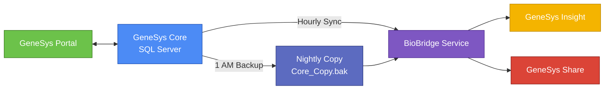
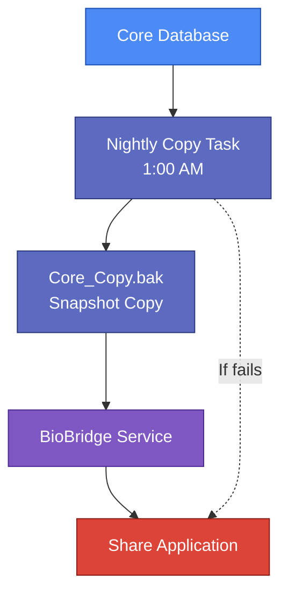

---

# GeneSys Research Suite — System Overview

## Document Control

| Field                 | Detail                         |
| --------------------- | ------------------------------ |
| Document Version      | 1.0                            |
| Last Updated          | November 2025                  |
| Author                | Hashim Zaffar                  |
| Reviewed By           | —                              |
| Approved By           | —                              |
| Document Status       | Draft / Approved / Final       |
| Confidentiality Level | Internal / Restricted / Public |

---

This document provides a concise overview of the GeneSys Research Suite for internal teams including Support, Customer Success, and QA. It explains the role of each product, how data flows between components, and the operational design choices that shape the platform. It assumes technical familiarity but does not require software development experience.

---

# 1. Deployment Model and Hosting

The GeneSys ecosystem uses a **single-tenant, on-premise model**:

* Each client receives its own Windows Server, SQL Server database, and IIS-hosted web applications.
* No infrastructure is shared between clients.
* Environments aim for approximately 90 percent standardization, although product licensing and historical configurations introduce variation.

Core components installed on each server:

* Microsoft SQL Server
* IIS (Internet Information Services)
* GeneSys Core application
* Optional web apps: Portal, Insight, Share
* BioBridge Windows Service
* Windows Scheduled Tasks (nightly database copy, hourly sync)

---

# 2. System Components

## 2.1 GeneSys Core

* Used by scientists to record samples, sequencing runs, and laboratory results.
* Runs directly on the client’s Windows Server and stores all operational data in SQL Server.
* Authentication: Windows Authentication (Active Directory or local accounts).

## 2.2 Web Applications (IIS-hosted)

### GeneSys Portal

* Used by researchers to submit sequencing requests and check project status.
* Communicates directly with Core using REST APIs.
* Authentication: OAuth 2.0
* Does not use BioBridge.

### GeneSys Insight

* Analytics and visualization dashboard for experiment results.
* Receives hourly updates that BioBridge pushes from Core.
* Authentication: API Keys

### GeneSys Share

* Used to distribute sanitized and validated results to external collaborators.
* Reads from a nightly copy of the Core database rather than the live system.
* Authentication: Token-based
* Ensures external users never see incomplete or unverified data.

---

# 3. BioBridge Service (formerly “BioSync”)

BioBridge is a Windows Service responsible for automated data movement between systems.

Primary responsibilities:

* Hourly: Push Core data to Insight
* Nightly: Load the copied database generated by the backup task and update Share

Naming notes:

* Current name: BioBridge Service
* Legacy names: BioSync, Bridge Sync, Integration Layer
* Older environments and support tickets may still reference these historical terms.

Portal does not depend on BioBridge.

---

# 4. System Data Flow

Different products interact with Core through different mechanisms:

* Portal ↔ Core: Two-way REST API communication
* Core → Insight: Hourly data push through BioBridge
* Core → Nightly Copy → BioBridge → Share: Daily update cycle

### Diagram 1 — High-Level Data Flow

---

# 5. Nightly Database Copy (Share Data Pipeline)

Share does not connect to the live Core database because external users must only see validated results. To ensure data integrity:

* A Windows Scheduled Task runs nightly at 1:00 AM.
* It produces a SQL backup file named `Core_Copy.bak`.
* BioBridge reads the backup file and updates Share based on the snapshot.

Operational issues observed:

* Disk space shortages can prevent backup creation.
* Backup paths differ across client environments, for example:

  * `D:\BioBridge\Copies\Core_Copy.bak`
  * `E:\GeneSys\Backup\Core_Copy.bak`
* Misconfigurations may cause Share to display outdated results.

### Diagram 2 — Nightly Copy and Share Update Process

---

# 6. Authentication Overview

| Component | Authentication Method  | Notes                                 |
| --------- | ---------------------- | ------------------------------------- |
| Core      | Windows Authentication | Uses domain or local Windows accounts |
| Portal    | OAuth 2.0              | Used by researchers                   |
| Insight   | API Keys               | Machine-to-machine communication      |
| Share     | Token-based            | Lightweight external access           |

---

# 7. Naming and Terminology Standards

To maintain consistency:

* Use “BioBridge Service” as the canonical term in all internal documentation.
* When reviewing logs or older deployments, note that BioSync, Bridge Sync, and Integration Layer refer to the same underlying service.
* Recommended standard backup path:
  `D:\BioBridge\Copies\Core_Copy.bak`
  (Client environments may deviate.)

---

# 8. Known Variations and Support Considerations

* Some labs deploy only Insight, only Portal, or combinations such as Insight + Share.

* Backup tasks commonly fail due to insufficient disk space.

* Support teams often encounter confusion regarding Share updates:

  * Share is updated through the nightly database copy and BioBridge, not through the hourly sync.

* Portal is the only product that bypasses BioBridge.

---

# 9. Assumptions

To maintain consistency in this overview, the following assumptions are made:

1. BioBridge is the official and supported name; BioSync is deprecated.
2. The intended backup directory is `D:\BioBridge\Copies\`, with exceptions handled case-by-case.
3. Standard IIS port assignments (unless overridden):

   * 8080 Portal
   * 8081 Insight
   * 8082 Share
4. Share never connects to the live Core database.
5. BioBridge handles both hourly Insight syncing and nightly Share updates.
