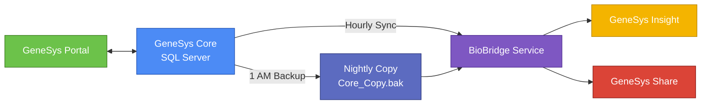
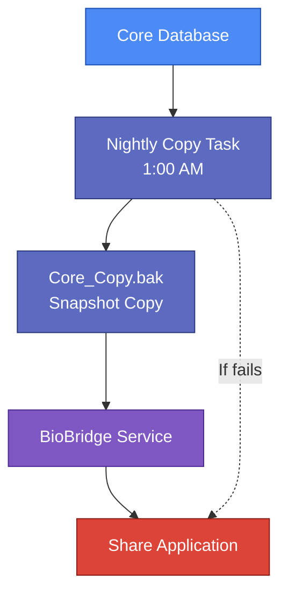

---

# **GeneSys Research Suite — System Overview (Internal Use)**

## **Document Control**

| Field                     | Detail                         |
| ------------------------- | ------------------------------ |
| **Document Version**      | 1.0                            |
| **Last Updated**          | November 2025                  |
| **Author**                | Hashim Zaffar                  |
| **Reviewed By**           | —                              |
| **Approved By**           | —                              |
| **Document Status**       | Draft / Approved / Final       |
| **Confidentiality Level** | Internal / Restricted / Public |

---

This document provides a clear, concise overview of the **GeneSys Research Suite** for internal teams (Support, Customer Success, QA). It describes the system’s core components, hosting model, data flow, and operational dependencies. The goal is to enable new and existing team members to quickly understand how the ecosystem fits together and why certain design choices exist.

---

# **1. Deployment Model and Hosting**

GeneSys uses a **single-tenant, on-premise deployment model**, meaning each lab receives a fully isolated environment:

* A dedicated **Windows Server**
* A dedicated **Microsoft SQL Server** database
* Independent **IIS-hosted web applications**
* Localized services and scheduled tasks

No infrastructure is shared between clients, ensuring stronger data isolation and simplified compliance.

While the deployment process aims for **~90% configuration consistency**, variance occurs due to:

* Differences in licensed products (Portal / Insight / Share)
* Non-standardized backup paths
* Historical configurations and legacy naming conventions

**Core system components installed on every server:**

* Microsoft SQL Server
* IIS (Internet Information Services)
* GeneSys Core application
* Optional web apps: **Portal**, **Insight**, **Share**
* **BioBridge Windows Service**
* Windows Scheduled Tasks (nightly DB copy, hourly sync jobs)

---

# **2. System Components**

## **2.1 GeneSys Core**

The Core application is the central operational system used by lab scientists for:

* Sample intake
* Sequencing run recording
* Experiment lifecycle management

It runs directly on Windows Server and stores all primary data in SQL Server.

**Authentication:** Windows Authentication (Active Directory or Local Accounts)

---

## **2.2 IIS-Hosted Web Applications**

### **GeneSys Portal**

* Used by researchers to create sequencing requests and track project progress.
* Communicates **directly** with Core using REST APIs.
* **Authentication:** OAuth 2.0
* **Does not depend on BioBridge.**

---

### **GeneSys Insight**

* Provides analytical dashboards and experiment summaries.
* Requires **hourly data pushes** from Core through BioBridge.
* **Authentication:** API Keys

---

### **GeneSys Share**

* Enables external visibility for sanitized, approved results.
* Reads from a **nightly SQL database copy**, ensuring unverified or partial data never reaches external users.
* **Authentication:** Token-based

---

# **3. BioBridge Service (formerly “BioSync”)**

BioBridge is a Windows Service that performs all automated data movement between GeneSys components.

**Primary Responsibilities:**

* **Hourly Sync:** Core → Insight
* **Nightly Processing:** Load the new Core database copy → Update Share

**Naming Notes (critical for support consistency):**

* **Official name:** BioBridge Service
* **Legacy names:** BioSync, Bridge Sync, Integration Layer
* These may still appear in old deployments or customer tickets.

**Important:** Portal does **not** use BioBridge; it communicates directly with Core.

---

# **4. System Data Flow**

Data flow differs by subsystem:

* **Portal ↔ Core:** Two-way REST API operations
* **Insight:** Receives **hourly** Core updates via BioBridge
* **Share:** Updated using the **nightly** backup copy, not live data

### **Diagram 1 — High-Level Data Flow (GitHub-Friendly Mermaid)**



---

# **5. Nightly Database Copy (Share Data Pipeline)**

Share intentionally avoids the live Core database to protect data integrity and ensure that:

* Only **finalized** and **validated** results are exposed externally.
* Lab staff control the timing of what becomes publicly visible.

### **Process Overview**

1. A Windows Scheduled Task runs nightly at **1:00 AM**.
2. Core database is backed up to create `Core_Copy.bak`.
3. BioBridge loads the copied file.
4. Share is refreshed using the snapshot.

### **Common Operational Issues**

* **Disk capacity issues** preventing backup creation
* **Nonstandard backup paths** (D:\ vs E:)
* **Incorrect BioBridge configuration** pointing to outdated paths
* **Stale data complaints** when tasks fail silently

### **Diagram 2 — Nightly Copy and Share Update Flow**



---

# **6. Authentication Overview**

| Component   | Authentication Method  | Notes                              |
| ----------- | ---------------------- | ---------------------------------- |
| **Core**    | Windows Authentication | Uses domain/local Windows accounts |
| **Portal**  | OAuth 2.0              | Researcher-facing authentication   |
| **Insight** | API Keys               | Service-level authentication       |
| **Share**   | Token-based            | Lightweight external access        |

---

# **7. Naming and Terminology Standards**

To maintain clarity across teams and documentation:

* Always refer to the synchronization service as **“BioBridge Service.”**
* Acknowledge legacy names only when referencing historical logs or older environments.
* Use a consistent recommended backup location:

```
D:\BioBridge\Copies\Core_Copy.bak
```

(Actual paths may vary based on client environment.)

---

# **8. Known Variations and Support Considerations**

* Some clients deploy only a subset of products (e.g., Core + Insight, Insight + Share).
* Backup tasks frequently fail due to disk space limitations.
* Customers often confuse the **hourly sync** with the **nightly Share update**.
* Portal bypasses BioBridge entirely, which is a common source of misunderstanding.

---

# **9. Assumptions (Explicit)**

These assumptions ensure consistency when documentation conflicts exist:

1. **BioBridge** is the official and supported service name moving forward.
2. The standard backup directory should be **D:\BioBridge\Copies** unless otherwise specified.
3. Standard IIS deployment ports (unless customized):

   * 8080 — Portal
   * 8081 — Insight
   * 8082 — Share
4. Share **never** connects to the live Core database.
5. BioBridge handles **both** hourly Insight syncs and nightly Share refreshes.

---

# **10. Appendix (Optional)**

* Deployment checklist
* Task Scheduler error references
* Example BioBridge logs showing hourly and nightly processing
