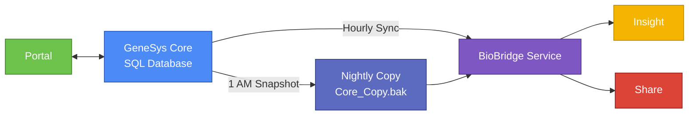
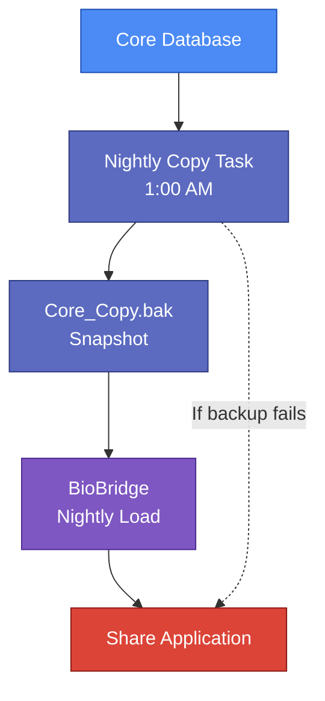

---

# GeneSys Research Suite

## System Overview (Internal Use)

## Document Control

| Field                 | Detail        |
| --------------------- | ------------- |
| Document Version      | 1.1           |
| Last Updated          | November 2025 |
| Author                | Hashim Zaffar |
| Reviewed By           | —             |
| Approved By           | —             |
| Document Status       | Draft         |
| Confidentiality Level | Internal      |

---

## 1. Purpose of This Document

This document provides a structured, high-level overview of the **GeneSys Research Suite** for Support, Customer Success, and QA teams. It explains:

* Each system component and its role
* How data moves between applications
* Why the platform uses both real-time and snapshot-based data flows
* Authentication models and hosting architecture
* Common operational considerations and troubleshooting points

Technical familiarity with Windows Server and SQL is helpful but not required.

---

# 2. Architecture & Deployment Model

## 2.1 Single-Tenant, On-Premise Design

The GeneSys ecosystem follows a **single-tenant architecture**, meaning:

* Each client receives its **own Windows Server**, SQL Server database, and IIS-hosted applications.
* Components do not share infrastructure across clients.
* Environments target ~90% standardization, but differences arise due to licensing, legacy setups, and custom configurations.

This model ensures data isolation, predictable troubleshooting, and simplified compliance.

## 2.2 Standard Installed Components

| Component             | Required?        | Description                                                       |
| --------------------- | ---------------- | ----------------------------------------------------------------- |
| **GeneSys Core**      | ✔ Yes            | Primary application for lab scientists; authoritative data source |
| **Portal**            | Optional         | Used for request submission                                       |
| **Insight**           | Optional         | Analytics dashboard                                               |
| **Share**             | Optional         | External-facing results portal                                    |
| **BioBridge Service** | ✔ Yes            | Synchronization engine for Insight & Share                        |
| **Nightly Copy Task** | If Share enabled | Produces read-only snapshot for Share                             |

---

# 3. Component Overview

## 3.1 GeneSys Core

The central hub of the ecosystem.

* Runs on Windows Server
* Stores all operational data in SQL Server
* Uses **Windows Authentication**
* Serves as the **system of record**
* Powers Portal real-time operations and acts as the source for Insight and Share data

## 3.2 IIS Web Applications

### **GeneSys Portal**

A researcher-facing interface for sequencing requests and project tracking.

* Communicates directly with Core using **two-way REST APIs**
* Authentication: **OAuth 2.0**
* **Does not use BioBridge**

### **GeneSys Insight**

Interactive dashboards for analytics and experiment performance.

* Receives **hourly** data updates via BioBridge
* Authentication: **API Keys**

### **GeneSys Share**

External portal for delivering sanitized, validated results to collaborators.

* Uses the **nightly snapshot** of Core data
* Authentication: **Token-based**
* Completely isolated from live Core data to avoid exposing in-progress or unvalidated work

---

# 4. BioBridge Service

**BioBridge** (also historically called *BioSync*, *Bridge Sync*, or *Integration Layer*) is a Windows Service responsible for data synchronization across GeneSys components.

### Core Responsibilities

| Operation                 | Frequency | Purpose                             |
| ------------------------- | --------- | ----------------------------------- |
| **Core → Insight Sync**   | Hourly    | Populate Insight’s analytics tables |
| **Core_Copy.bak → Share** | Nightly   | Refresh Share’s read-only data      |

Portal bypasses BioBridge entirely and uses direct REST integration.

---

# 5. Data Flow Overview

GeneSys uses two complementary data flow models:

* **Real-time (Portal):** Direct interaction with Core for workflow updates
* **Near real-time (Insight):** Hourly syncs to balance timeliness with server load
* **Delayed snapshot (Share):** Nightly copies to guarantee data integrity

### High-Level Data Flow Diagram

### Summary Table

| Product     | Data Source   | Method                 |
| ----------- | ------------- | ---------------------- |
| **Portal**  | Live Core     | REST API (two-way)     |
| **Insight** | Core          | BioBridge hourly push  |
| **Share**   | Core_Copy.bak | BioBridge nightly load |

---

# 6. Nightly Copy Task (Share Data Pipeline)

Because Share is externally accessible, it cannot expose live, unreviewed data. Therefore:

### Nightly Workflow (1:00 AM)

1. **Windows Scheduled Task** triggers the database backup.
2. SQL Server generates **Core_Copy.bak**, a full snapshot of the Core database.
3. **BioBridge** reads this snapshot.
4. Share’s database is refreshed based on the copied data.

This ensures that Share displays only validated, finalized results.

### Common Issues

* **Disk exhaustion** leading to backup failure
* Backup file stored in inconsistent paths:

  * `D:\BioBridge\Copies\Core_Copy.bak` (recommended standard)
  * `E:\GeneSys\Backup\Core_Copy.bak` (historical)
* If the task fails, Share remains stale until the next successful run

### Nightly Copy Diagram

---

# 7. Authentication Overview

| Component   | Method                 | Notes                               |
| ----------- | ---------------------- | ----------------------------------- |
| **Core**    | Windows Authentication | Uses AD or local accounts           |
| **Portal**  | OAuth 2.0              | Researcher-facing                   |
| **Insight** | API Keys               | Service-to-service access           |
| **Share**   | Token-based            | Lightweight external authentication |

---

# 8. Support & Operational Considerations

* Share updates **only** through the nightly snapshot, not the hourly sync.
* Portal issues typically involve **Core API**, not BioBridge.
* The nightly copy task failing is the **most common cause** of stale data in Share.
* Legacy terminology (BioSync, Bridge Sync) may still appear in older environments or tickets.
* Standardizing backup paths reduces misconfigurations during provisioning.

### Recommended Standards

* Canonical service name: **BioBridge Service**
* Backup path: **D:\BioBridge\Copies\Core_Copy.bak**
* Default IIS ports:

  * Portal: 8080
  * Insight: 8081
  * Share: 8082

---

# 9. Audience

This document is intended for:

* **Support** teams diagnosing client issues
* **Customer Success** teams provisioning or configuring environments
* **QA** teams validating data flows and product interactions

---

# 10. Assumptions

1. BioBridge is the current supported name for the synchronization service.
2. Share never connects to the live Core database.
3. The nightly snapshot is always the source of truth for Share.
4. IIS port defaults apply unless specified per client.
5. Each client operates an independent, single-tenant environment.
