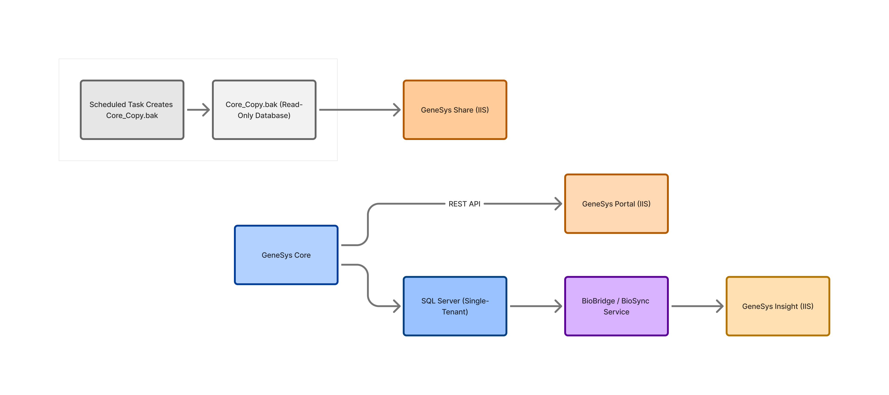

---

# **1. Introduction**

## **1.1 Purpose of This Document**

This System Overview provides internal staff with a clear, high-level understanding of how the GeneSys Research Suite operates. 

It explains the major components of the system, how they interact, and why specific architectural decisions were made. This document is intended for Customer Success (CS), Support, and Quality Assurance (QA) teams who work with client environments but do not need deep developer-level detail. 

The goal is to give new team members the context required to understand the overall ecosystem before moving into deployment, troubleshooting, or client-specific tasks.

## **1.2 Audience**

This document is written for:

* Customer Success specialists
* Support engineers
* QA analysts
* Any technical staff who assist with deployment, configuration, or troubleshooting

It assumes basic familiarity with Windows Server concepts but does not require programming expertise.

## **1.3 System Summary**

The GeneSys Research Suite is a set of on-premise software applications used by life sciences laboratories to manage sequencing workflows. Each client operates on a *single-tenant Windows Server environment* that hosts all components of the platform, including the SQL Server database, IIS web applications, and background services.

The suite consists of:

* **GeneSys Core:** The mandatory central application where scientists record samples, sequencing runs, and results.
* **GeneSys Portal:** A web interface for researchers to submit sequencing requests and monitor project progress.
* **GeneSys Insight:** An analytics dashboard that receives hourly data updates from Core.
* **GeneSys Share:** An external-facing, read-only web application used to publish validated results.
* **BioBridge Service:** A background Windows Service that synchronizes data between Core and the web applications. (Also known historically as *BioSync*.)

At a high level, all components live on one server per client. The following diagram illustrates this architecture:

## **1.4 Key Assumptions**

The information provided in internal notes, emails, and logs contains inconsistencies. To create a clear and standardized overview, the following assumptions are made:

* **BioBridge** is the official name of the data synchronization service. “BioSync,” “Bridge Sync,” and similar terms are considered legacy references.
* The nightly database copy is assumed to use the path most frequently referenced in logs and emails unless otherwise configured per client.
* The authentication types listed for each product represent the current intended configuration; earlier references to mixed or uncertain authentication methods are treated as outdated.
* IIS ports follow the deployment checklist defaults unless overridden during installation.
